# Lumenote — Diagrams

Mermaid diagrams for architecture, flows, and data model. View in GitHub, VS Code, or any Mermaid-capable Markdown previewer.

---

## 1. Flow Diagrams

### 1a. System / Data Flow

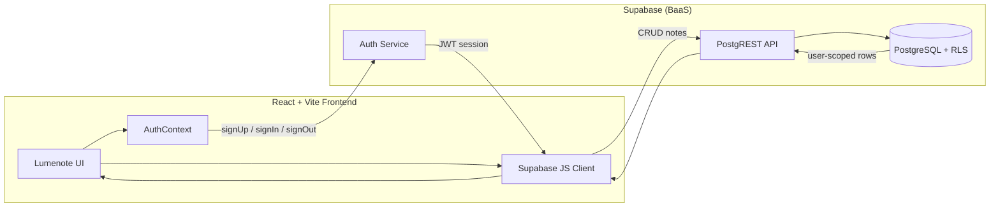

### 1b. User Journey

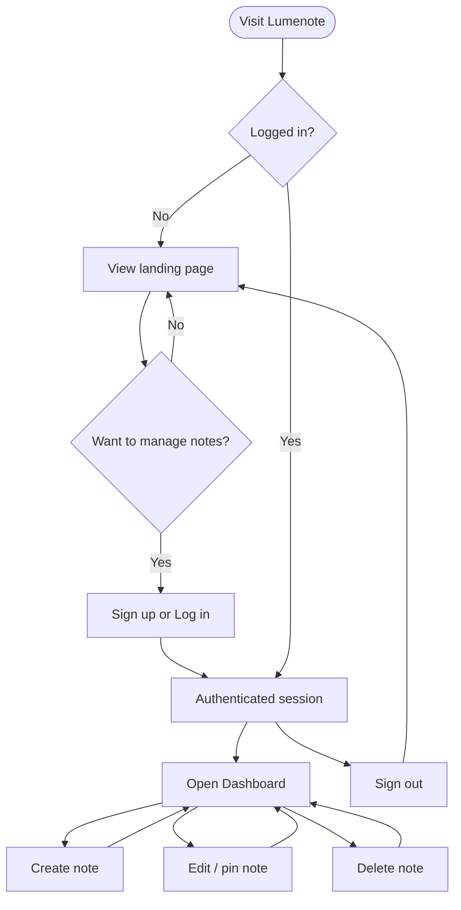

### 1c. Note CRUD Flow

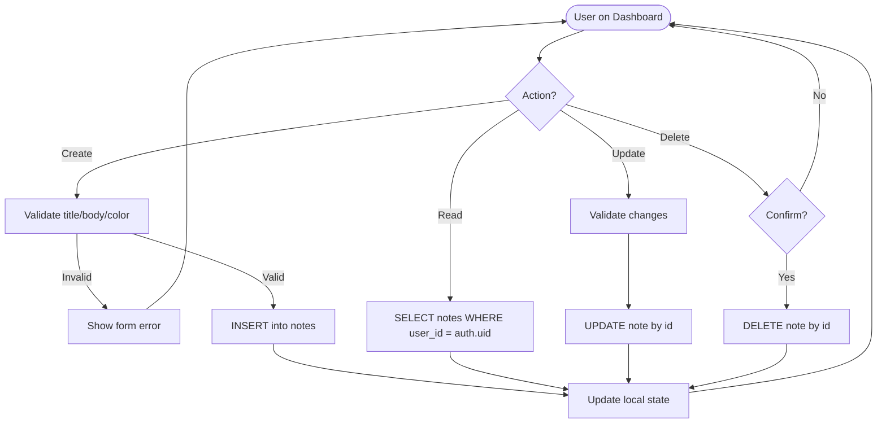

---

## 2. State Diagrams

### 2a. Authentication Session

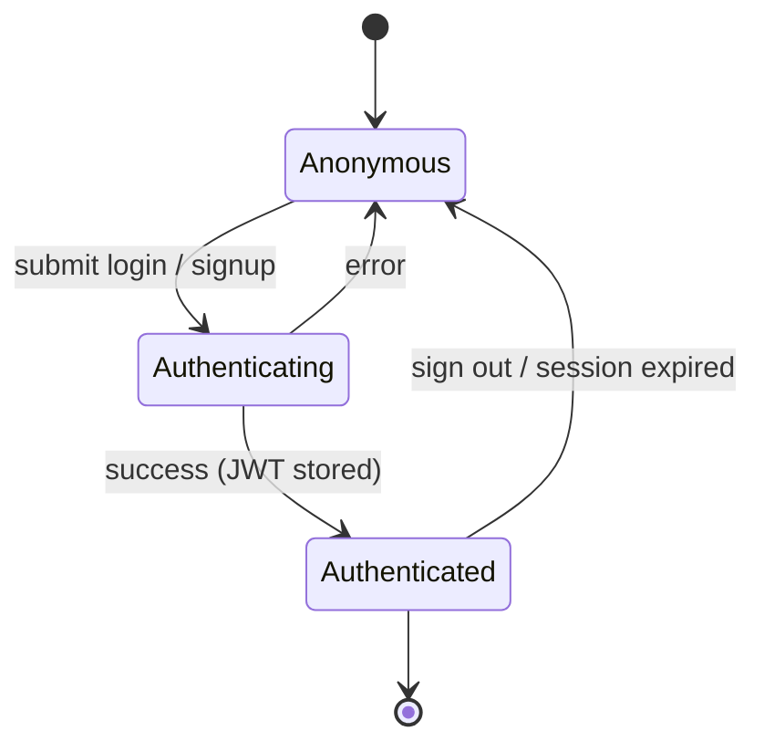

### 2b. Dashboard View Mode

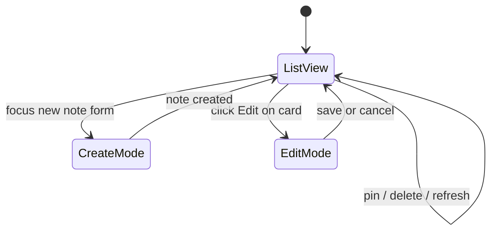

---

## 3. Entity-Relationship Diagram

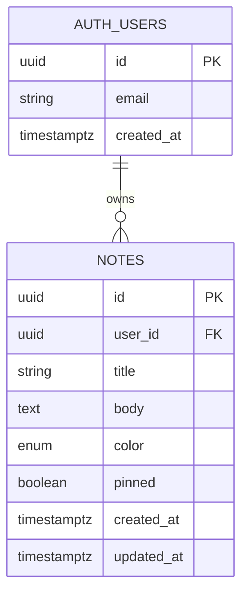

---

## 4. Deployment Topology

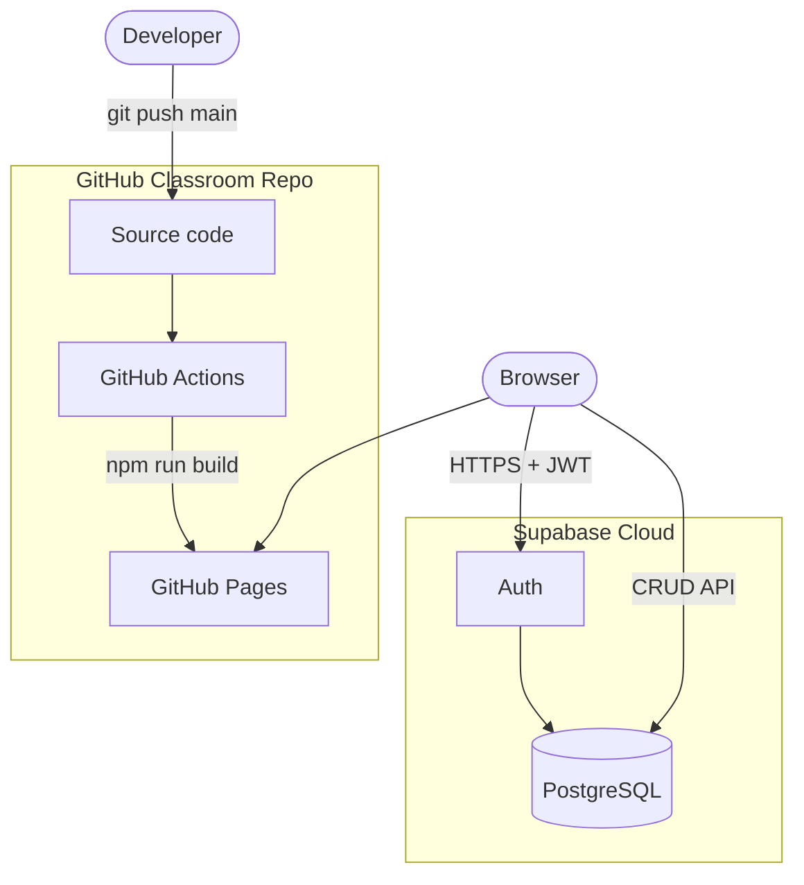

---

## 5. Sequence Diagram — Create Note

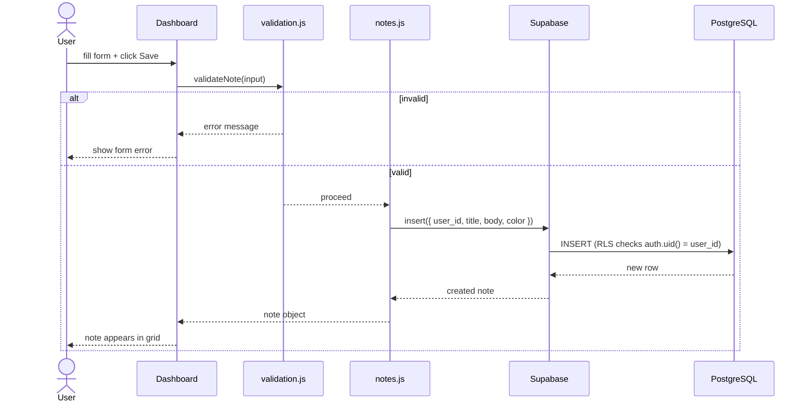

---

## 6. Sequence Diagram — Protected Route

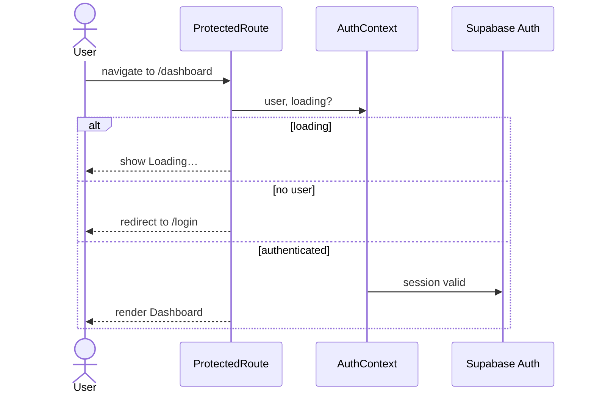

---

## 7. Frontend Component Hierarchy

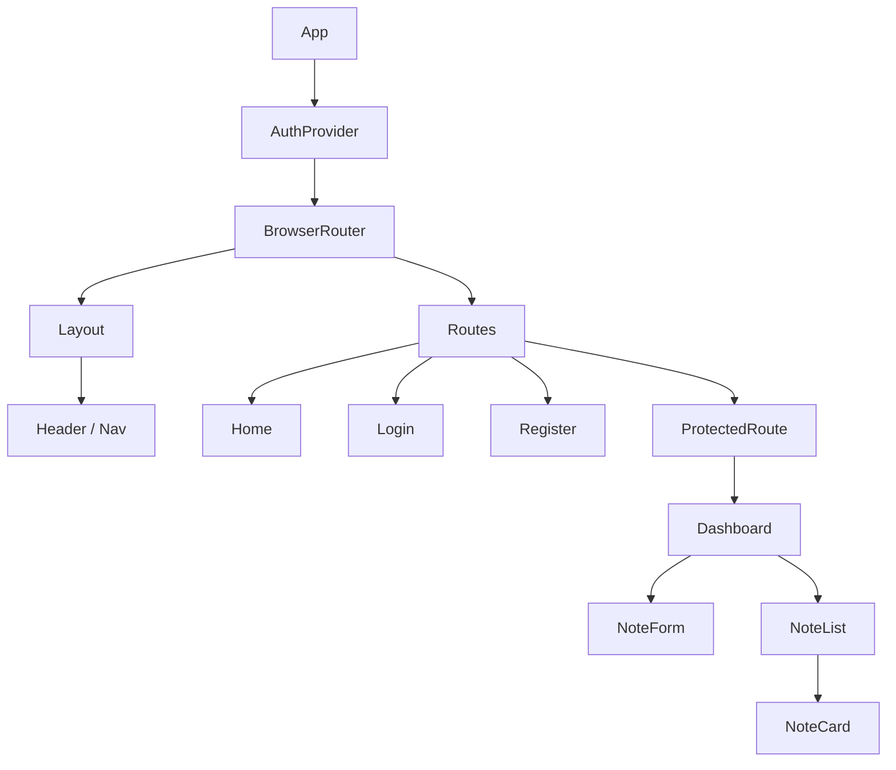

---

## 8. RLS Permission Matrix

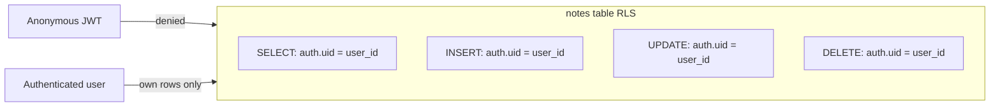
