# Lumenote — Diagrams

Mermaid diagrams for architecture, flows, and data model. View in GitHub, VS Code, or any Mermaid-capable Markdown previewer.

---

## 1. Flow Diagrams

### 1a. System / Data Flow

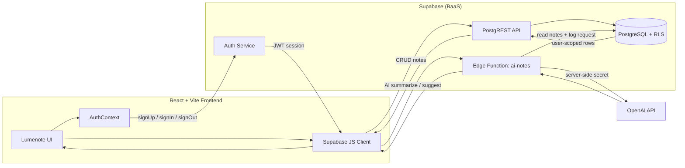
```mermaid
flowchart LR
    subgraph Client["React + Vite Frontend"]
        UI[Lumenote UI]
        SDK[Supabase JS Client]
        CTX[AuthContext]
    end

    subgraph Supabase["Supabase (BaaS)"]
        AUTH[Auth Service]
        API[PostgREST API]
        FN[Edge Function: ai-notes]
        DB[(PostgreSQL + RLS)]
    end

    AI[OpenAI API]

    UI --> CTX
    UI --> SDK
    CTX -->|signUp / signIn / signOut| AUTH
    SDK -->|CRUD notes| API
    SDK -->|AI summarize / suggest| FN
    AUTH -->|JWT session| SDK
    API --> DB
    FN -->|read notes + log request| DB
    FN -->|server-side secret| AI
    DB -->|user-scoped rows| API
    API --> SDK --> UI
    AI --> FN --> SDK
```

### 1b. User Journey

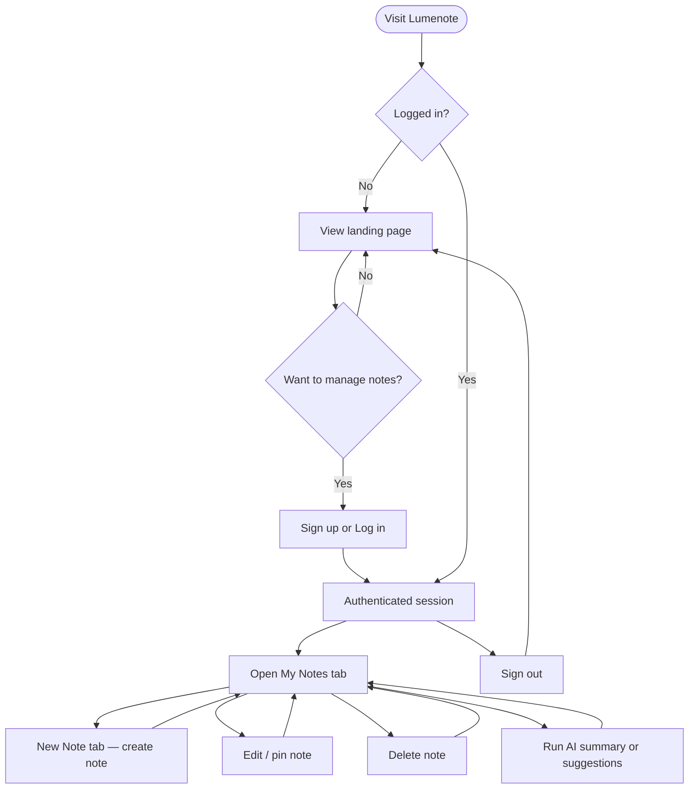
```mermaid
flowchart TD
    A([Visit Lumenote]) --> B{Logged in?}
    B -- No --> C[View landing page]
    C --> D{Want to manage notes?}
    D -- Yes --> E[Sign up or Log in]
    E --> F[Authenticated session]
    D -- No --> C
    B -- Yes --> F
    F --> G[Open My Notes tab]
    G --> H[New Note tab — create note]
    G --> I[Edit / pin note]
    G --> J[Delete note]
    G --> L[Run AI summary or suggestions]
    H --> G
    I --> G
    J --> G
    L --> G
    F --> K[Sign out]
    K --> C
```

### 1c. Note CRUD Flow

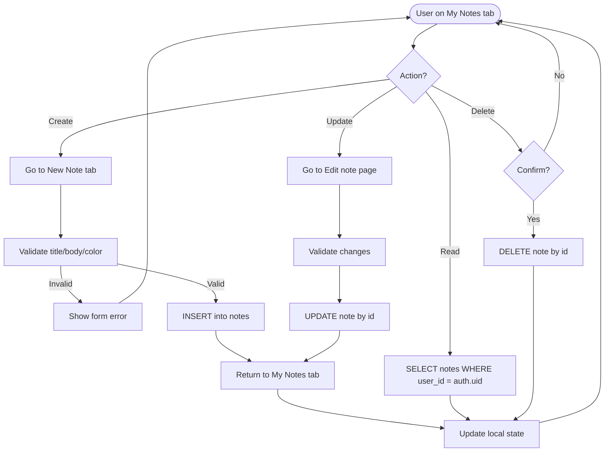
```mermaid
flowchart TD
    START([User on My Notes tab]) --> ACTION{Action?}
    ACTION -->|Create| NAV[Go to New Note tab]
    NAV --> VAL1[Validate title/body/color]
    VAL1 -->|Invalid| ERR[Show form error]
    VAL1 -->|Valid| INS[INSERT into notes]
    INS --> BACK[Return to My Notes tab]
    BACK --> REFRESH[Update local state]
    ACTION -->|Read| SEL[SELECT notes WHERE user_id = auth.uid]
    SEL --> REFRESH
    ACTION -->|Update| EDIT[Go to Edit note page]
    EDIT --> VAL2[Validate changes]
    VAL2 --> UPD[UPDATE note by id]
    UPD --> BACK
    ACTION -->|Delete| CONF{Confirm?}
    CONF -- No --> START
    CONF -- Yes --> DEL[DELETE note by id]
    DEL --> REFRESH
    REFRESH --> START
    ERR --> START
```

Note bodies may contain **HTML** from the TipTap rich-text editor (headings, lists, images). AI prompts strip HTML to plain text before calling OpenAI.

### 1c-b. Rich Text & Image Upload

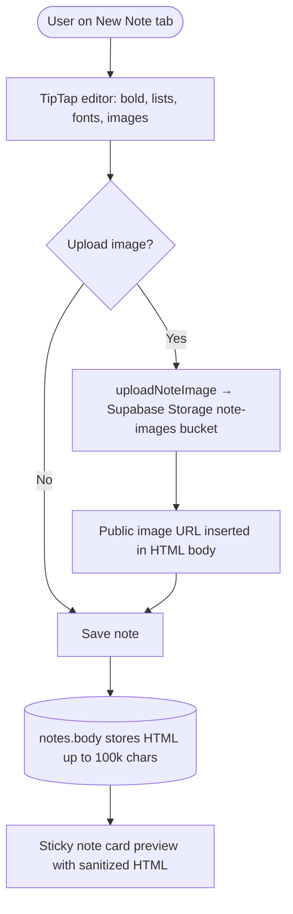
```mermaid
flowchart TD
    START([User on New Note tab]) --> EDIT[TipTap editor: bold, lists, fonts, images]
    EDIT --> IMG{Upload image?}
    IMG -- Yes --> UP[uploadNoteImage → Supabase Storage note-images bucket]
    UP --> URL[Public image URL inserted in HTML body]
    IMG -- No --> SAVE[Save note]
    URL --> SAVE
    SAVE --> DB[(notes.body stores HTML up to 100k chars)]
    DB --> CARD[Sticky note card preview with sanitized HTML]
```

### 1d. Summarize Pipeline (AI #1)

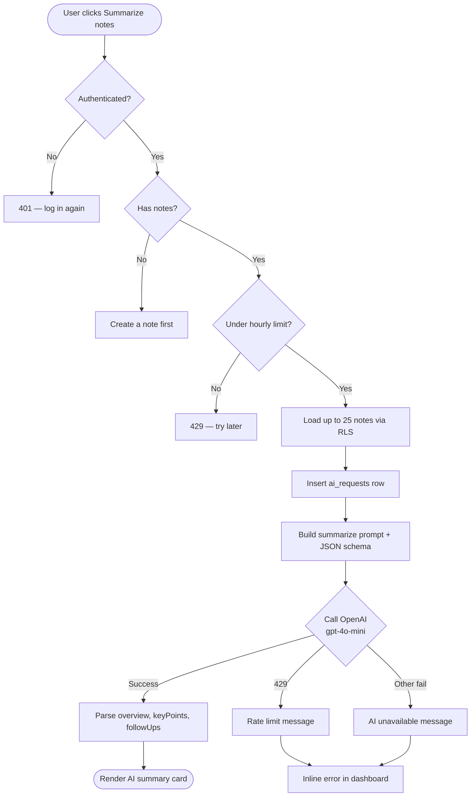
```mermaid
flowchart TD
    START([User clicks Summarize notes]) --> AUTH{Authenticated?}
    AUTH -- No --> E401[401 — log in again]
    AUTH -- Yes --> NOTES{Has notes?}
    NOTES -- No --> E400[Create a note first]
    NOTES -- Yes --> RATE{Under hourly limit?}
    RATE -- No --> E429[429 — try later]
    RATE -- Yes --> LOAD[Load up to 25 notes via RLS]
    LOAD --> LOG[Insert ai_requests row]
    LOG --> PROMPT[Build summarize prompt + JSON schema]
    PROMPT --> LLM{Call OpenAI<br/>gpt-4o-mini}

    LLM -- Success --> PARSE[Parse overview, keyPoints, followUps]
    PARSE --> OK([Render AI summary card])

    LLM -- 429 --> E429B[Rate limit message]
    LLM -- Other fail --> E503[AI unavailable message]
    E429B --> UI[Inline error in dashboard]
    E503 --> UI
```

### 1e. Suggest Pipeline (AI #2)

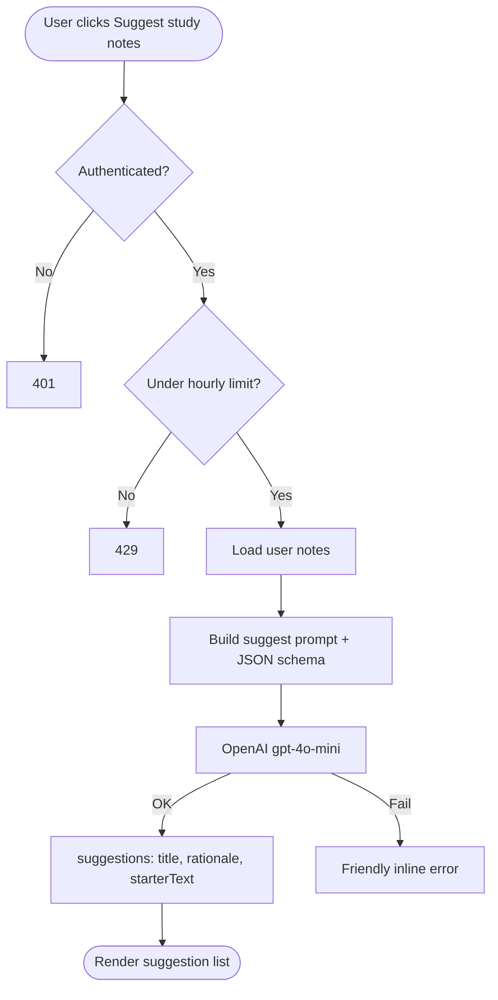
```mermaid
flowchart TD
    START([User clicks Suggest study notes]) --> AUTH{Authenticated?}
    AUTH -- No --> E401[401]
    AUTH -- Yes --> RATE{Under hourly limit?}
    RATE -- No --> E429[429]
    RATE -- Yes --> LOAD[Load user notes]
    LOAD --> PROMPT[Build suggest prompt + JSON schema]
    PROMPT --> LLM[OpenAI gpt-4o-mini]
    LLM -- OK --> OUT[suggestions: title, rationale, starterText]
    OUT --> DONE([Render suggestion list])
    LLM -- Fail --> ERR[Friendly inline error]
```

---

## 2. State Diagrams

### 2a. Authentication Session

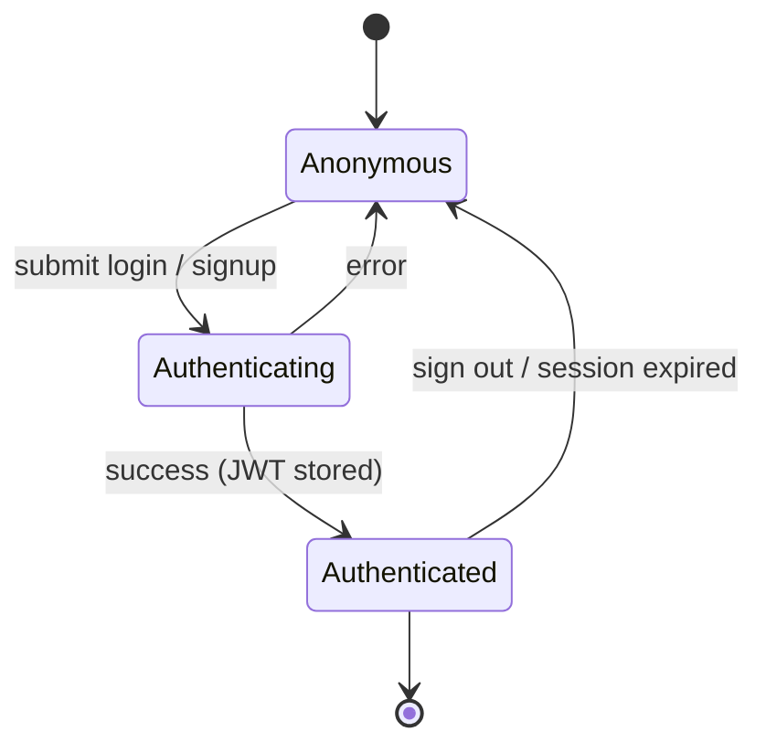
```mermaid
stateDiagram-v2
    [*] --> Anonymous
    Anonymous --> Authenticating: submit login / signup
    Authenticating --> Authenticated: success (JWT stored)
    Authenticating --> Anonymous: error
    Authenticated --> Anonymous: sign out / session expired
    Authenticated --> [*]
```

### 2b. App Navigation (Logged-in Tabs)

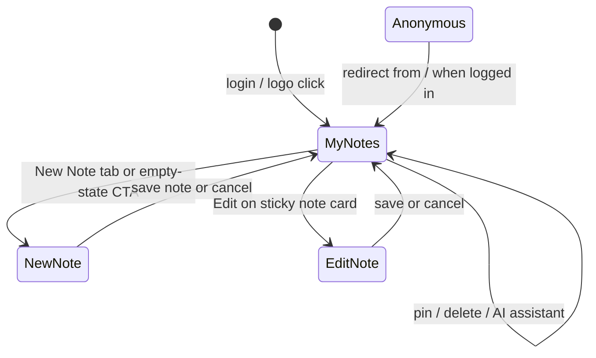
```mermaid
stateDiagram-v2
    [*] --> MyNotes: login / logo click
    MyNotes --> NewNote: New Note tab or empty-state CTA
    NewNote --> MyNotes: save note or cancel
    MyNotes --> EditNote: Edit on sticky note card
    EditNote --> MyNotes: save or cancel
    MyNotes --> MyNotes: pin / delete / AI assistant
    Anonymous --> MyNotes: redirect from / when logged in
```

### 2c. AI Assistant (UI + API)

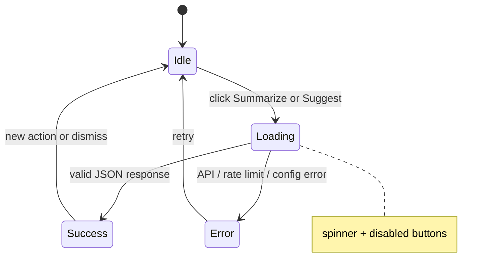
```mermaid
stateDiagram-v2
    [*] --> Idle
    Idle --> Loading: click Summarize or Suggest
    Loading --> Success: valid JSON response
    Loading --> Error: API / rate limit / config error
    Success --> Idle: new action or dismiss
    Error --> Idle: retry
    note right of Loading
        spinner + disabled buttons
    end note
```

---

## 3. Entity-Relationship Diagram

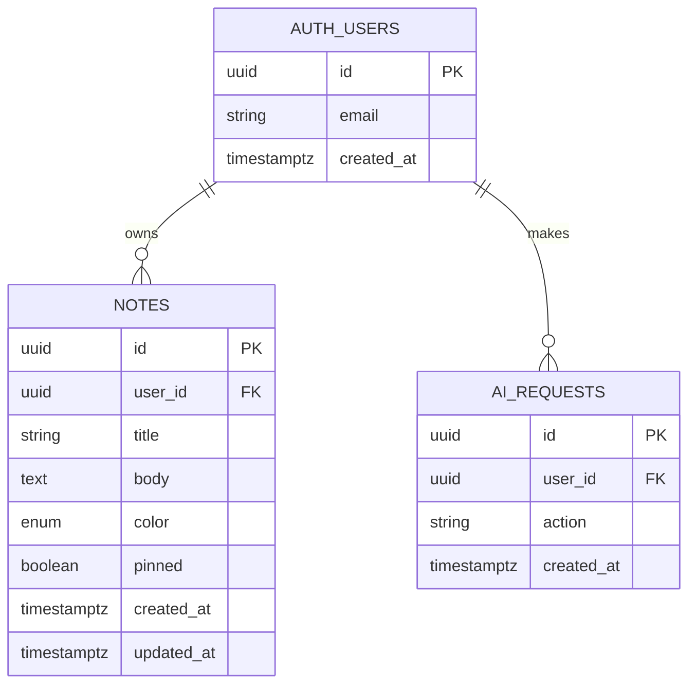
```mermaid
erDiagram
    AUTH_USERS ||--o{ NOTES : owns
    AUTH_USERS ||--o{ AI_REQUESTS : makes

    AUTH_USERS {
        uuid id PK
        string email
        timestamptz created_at
    }

    NOTES {
        uuid id PK
        uuid user_id FK
        string title
        text body
        enum color
        boolean pinned
        timestamptz created_at
        timestamptz updated_at
    }

    AI_REQUESTS {
        uuid id PK
        uuid user_id FK
        string action
        timestamptz created_at
    }
```

---

## 4. Deployment Topology

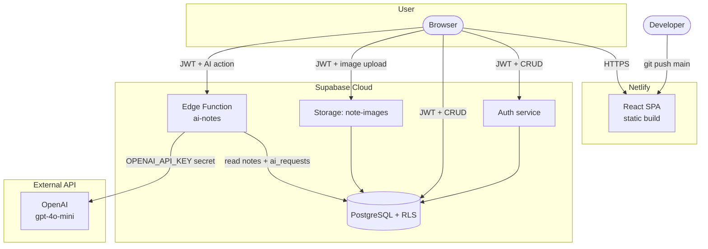
```mermaid
flowchart TB
    subgraph User["User"]
        BROWSER([Browser])
    end

    subgraph Netlify["Netlify"]
        SPA[React SPA<br/>static build]
    end

    subgraph SupabaseCloud["Supabase Cloud"]
        SAUTH[Auth service]
        PG[(PostgreSQL + RLS)]
        STOR[Storage: note-images]
        FN[Edge Function<br/>ai-notes]
    end

    subgraph External["External API"]
        OAI[OpenAI<br/>gpt-4o-mini]
    end

    DEV([Developer]) -->|git push main| SPA
    BROWSER -->|HTTPS| SPA
    BROWSER -->|JWT + CRUD| SAUTH
    BROWSER -->|JWT + CRUD| PG
    BROWSER -->|JWT + image upload| STOR
    BROWSER -->|JWT + AI action| FN
    FN -->|read notes + ai_requests| PG
    FN -->|OPENAI_API_KEY secret| OAI
    STOR --> PG
    SAUTH --> PG
```

**Key rule:** OpenAI key never reaches the browser — only Supabase Edge Function secrets.

---

## 5. Sequence Diagram — Create Note

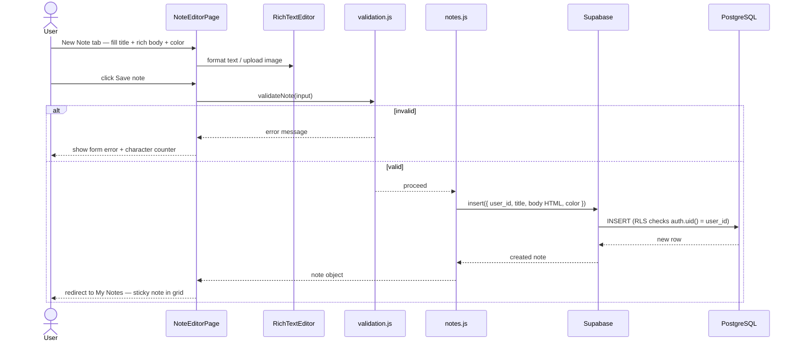
```mermaid
sequenceDiagram
    actor U as User
    participant UI as NoteEditorPage
    participant RTE as RichTextEditor
    participant VAL as validation.js
    participant API as notes.js
    participant SB as Supabase
    participant DB as PostgreSQL

    U->>UI: New Note tab — fill title + rich body + color
    UI->>RTE: format text / upload image
    U->>UI: click Save note
    UI->>VAL: validateNote(input)
    alt invalid
        VAL-->>UI: error message
        UI-->>U: show form error + character counter
    else valid
        VAL-->>API: proceed
        API->>SB: insert({ user_id, title, body HTML, color })
        SB->>DB: INSERT (RLS checks auth.uid() = user_id)
        DB-->>SB: new row
        SB-->>API: created note
        API-->>UI: note object
        UI-->>U: redirect to My Notes — sticky note in grid
    end
```

---

## 6. Sequence Diagram — AI Summarize (AI #1)

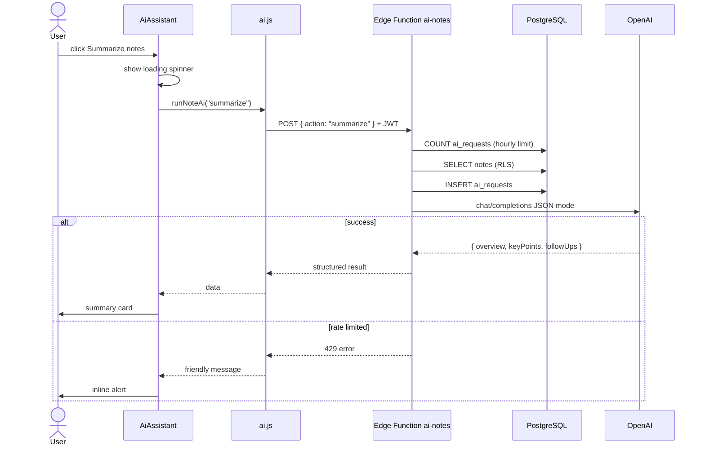
```mermaid
sequenceDiagram
    actor U as User
    participant UI as AiAssistant
    participant AI as ai.js
    participant FN as Edge Function ai-notes
    participant DB as PostgreSQL
    participant OAI as OpenAI

    U->>UI: click Summarize notes
    UI->>UI: show loading spinner
    UI->>AI: runNoteAi("summarize")
    AI->>FN: POST { action: "summarize" } + JWT
    FN->>DB: COUNT ai_requests (hourly limit)
    FN->>DB: SELECT notes (RLS)
    FN->>DB: INSERT ai_requests
    FN->>OAI: chat/completions JSON mode
    alt success
        OAI-->>FN: { overview, keyPoints, followUps }
        FN-->>AI: structured result
        AI-->>UI: data
        UI->>U: summary card
    else rate limited
        FN-->>AI: 429 error
        AI-->>UI: friendly message
        UI->>U: inline alert
    end
```

---

## 7. Sequence Diagram — Protected Route

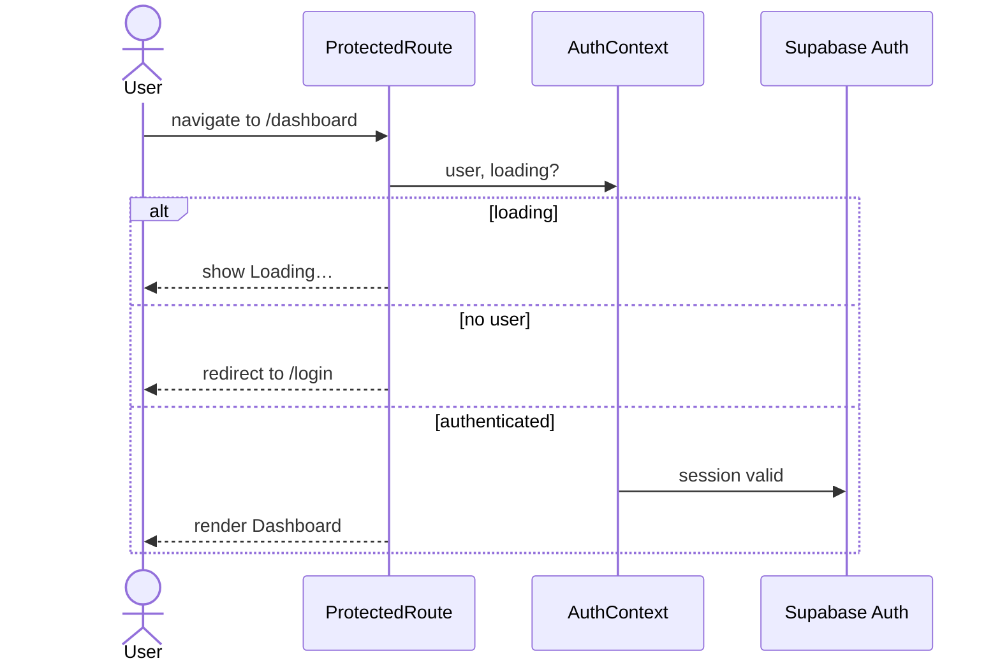
```mermaid
sequenceDiagram
    actor U as User
    participant RT as ProtectedRoute
    participant CTX as AuthContext
    participant SB as Supabase Auth

    U->>RT: navigate to /dashboard
    RT->>CTX: user, loading?
    alt loading
        RT-->>U: show Loading…
    else no user
        RT-->>U: redirect to /login
    else authenticated
        CTX->>SB: session valid
        RT-->>U: render Dashboard
    end
```

---

## 8. Frontend Component Hierarchy

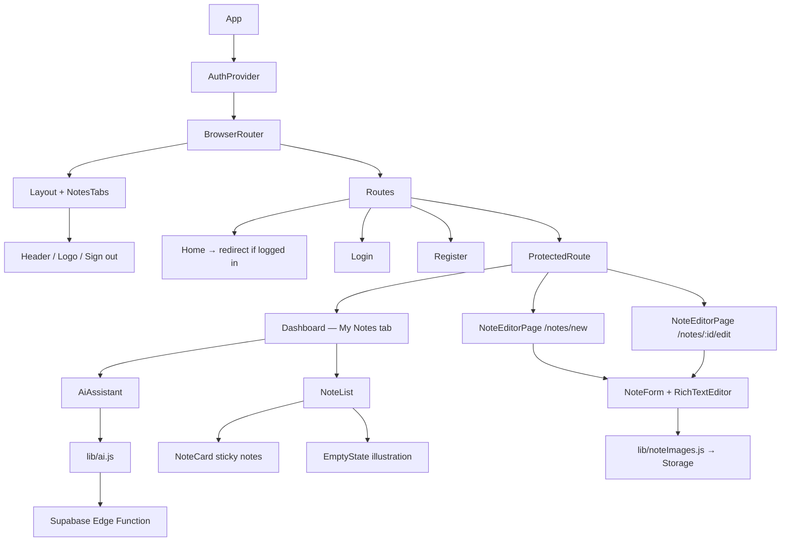
```mermaid
flowchart TD
    APP[App] --> AUTHP[AuthProvider]
    AUTHP --> RT[BrowserRouter]
    RT --> LAYOUT[Layout + NotesTabs]
    LAYOUT --> NAV[Header / Logo / Sign out]
    RT --> ROUTES[Routes]

    ROUTES --> HOME[Home → redirect if logged in]
    ROUTES --> LOGIN[Login]
    ROUTES --> REGISTER[Register]
    ROUTES --> PROTECT[ProtectedRoute]
    PROTECT --> DASH[Dashboard — My Notes tab]
    PROTECT --> NEW[NoteEditorPage /notes/new]
    PROTECT --> EDIT[NoteEditorPage /notes/:id/edit]

    DASH --> AI[AiAssistant]
    DASH --> LIST[NoteList]
    LIST --> CARD[NoteCard sticky notes]
    LIST --> EMPTY[EmptyState illustration]
    NEW --> FORM[NoteForm + RichTextEditor]
    EDIT --> FORM
    FORM --> STOR[lib/noteImages.js → Storage]
    AI --> AILIB[lib/ai.js]
    AILIB --> FN[Supabase Edge Function]
```

---

## 9. RLS Permission Matrix

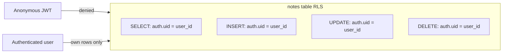
```mermaid
flowchart LR
    subgraph Policies["notes table RLS"]
        P1[SELECT: auth.uid = user_id]
        P2[INSERT: auth.uid = user_id]
        P3[UPDATE: auth.uid = user_id]
        P4[DELETE: auth.uid = user_id]
    end

    ANON[Anonymous JWT] -->|denied| Policies
    USER[Authenticated user] -->|own rows only| Policies
```

---

## 10. UI Wireframe — AI Assistant (ASCII)

```
┌─────────────────────────────────────────────────────────┐
│  AI STUDY ASSISTANT                                     │
│  Turn your notes into next steps                        │
├─────────────────────────────────────────────────────────┤
│  [ Summarize notes ]  [ Suggest study notes ]           │
├─────────────────────────────────────────────────────────┤
│  AI reviewed 4 note(s).                                 │
│  Overview: Your notes focus on React hooks and Supabase │
│  Key points:                                            │
│    • useEffect cleanup patterns                         │
│    • RLS policies for notes table                       │
│  Follow-ups:                                            │
│    • Write a note comparing auth flows                  │
└─────────────────────────────────────────────────────────┘
```

---

## 11. Error / Fallback Paths

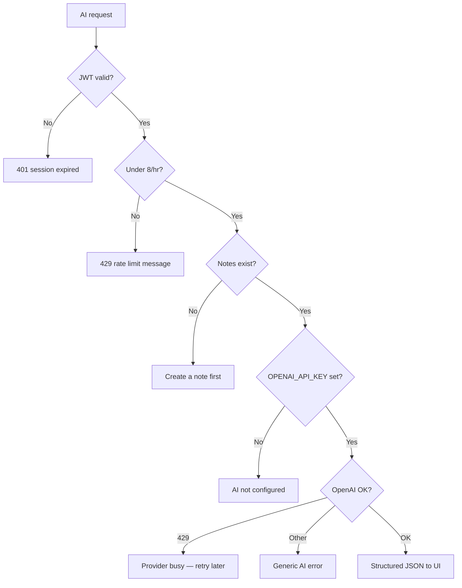
```mermaid
flowchart TD
    REQ[AI request] --> AUTH{JWT valid?}
    AUTH -- No --> E401[401 session expired]
    AUTH -- Yes --> LIMIT{Under 8/hr?}
    LIMIT -- No --> E429[429 rate limit message]
    LIMIT -- Yes --> NOTES{Notes exist?}
    NOTES -- No --> E400[Create a note first]
    NOTES -- Yes --> KEY{OPENAI_API_KEY set?}
    KEY -- No --> E503[AI not configured]
    KEY -- Yes --> OAI{OpenAI OK?}
    OAI -- 429 --> E429B[Provider busy — retry later]
    OAI -- Other --> E503B[Generic AI error]
    OAI -- OK --> OK[Structured JSON to UI]
```

---

## 12. Gate Requirements Map

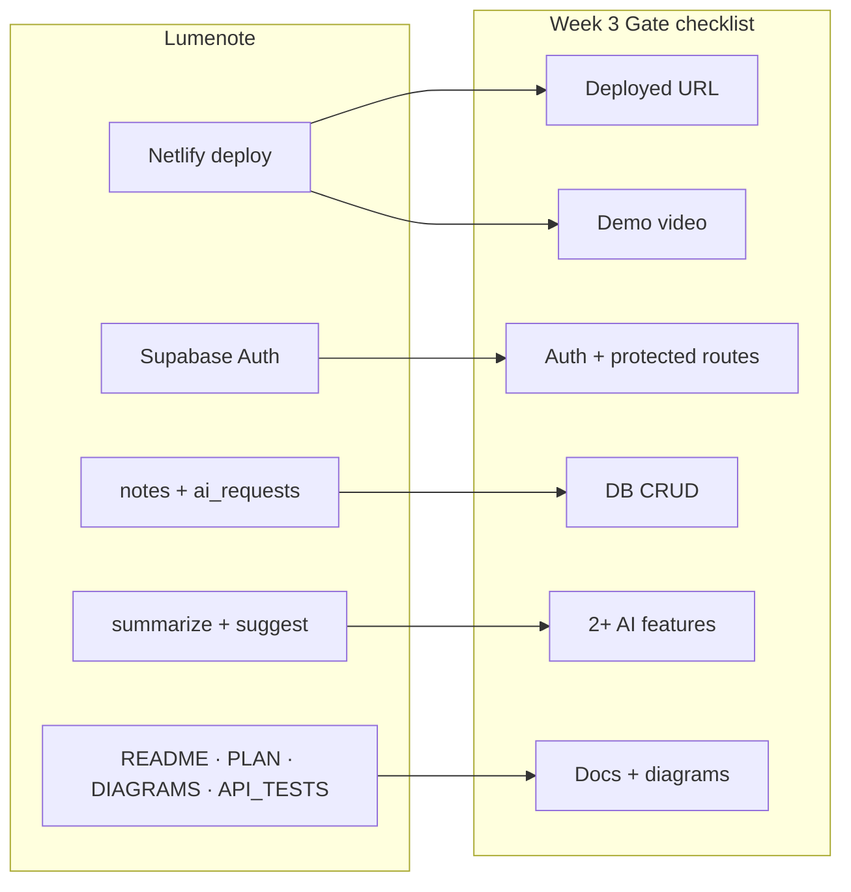
```mermaid
flowchart LR
    subgraph Gate["Week 3 Gate checklist"]
        G1[Deployed URL]
        G2[Auth + protected routes]
        G3[DB CRUD]
        G4[2+ AI features]
        G5[Docs + diagrams]
        G6[Demo video]
    end

    subgraph App["Lumenote"]
        V[Netlify deploy]
        A[Supabase Auth]
        D[notes + ai_requests]
        R[summarize + suggest]
        GH[README · PLAN · DIAGRAMS · API_TESTS]
    end

    V --> G1
    A --> G2
    D --> G3
    R --> G4
    GH --> G5
    V --> G6
```
