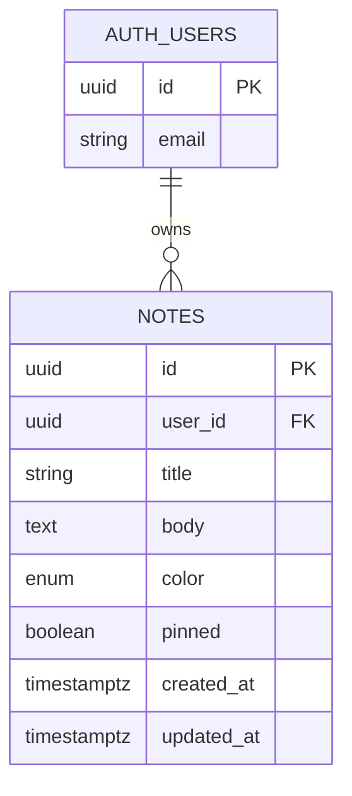

# Lumenote — Project Plan

> **Status:** Design v0.2 locked — review [mockup.html](./mockup.html), then begin BUILD_STEPS Step 1.
>
> **Assignment:** Week 2 Full-Stack (DB, Auth, CRUD, CI/CD)

A personal notes app where authenticated users capture, organize, and manage private study notes and ideas.

**Name:** *Lumen* (light) + *note* — illuminating your ideas.

---

## 1. Problem & Solution

| | |
|---|---|
| **Problem** | Students and learners need a simple, private place to jot notes without clutter or account friction. |
| **Solution** | Lumenote — lightweight notes with secure auth, full CRUD, pin, and color labels. |
| **Comparable to** | [PolyVote](https://github.com/djaramil/PolyVote) workflow: plan → mockup → incremental build |

---

## 2. MVP Scope (Week 2 — locked)

These are **in scope** for the assignment submission:

- [ ] User registration, login, logout (Supabase Auth)
- [ ] Create, read, update, delete personal notes
- [ ] Pin notes to top of list
- [ ] Color labels on notes
- [ ] Protected dashboard (auth required for all note actions)
- [ ] CI/CD deploy to GitHub Pages on push to `main`
- [ ] Documentation: README, PLAN, BUILD_STEPS, DIAGRAMS, DATABASE

---

## 3. Out of Scope (backlog)

Track in [ISSUES.md](./ISSUES.md) — do **not** build until MVP is done:

- Search / filter
- Tags or folders
- Markdown preview
- Google OAuth
- Real-time sync
- Export (PDF / Markdown)

---

## 4. Tech Stack (proposed — confirm in design review)

| Layer | Choice | Status |
|-------|--------|--------|
| Frontend | React 18 + Vite | Proposed |
| Routing | React Router v6 | Proposed |
| Styling | Custom CSS (see DESIGN.md) | **Iterate in mockup** |
| Backend / DB / Auth | Supabase (PostgreSQL + RLS) | Proposed |
| Hosting | GitHub Pages + GitHub Actions | Proposed |
| Node | 18+ (20 in CI) | Required |

---

## 5. Data Model (draft — confirm before schema.sql)

### `notes` fields

| Field | Type | Constraints | Notes |
|-------|------|-------------|-------|
| `id` | UUID | PK | Auto-generated |
| `user_id` | UUID | FK → auth.users | CASCADE delete |
| `title` | text | 1–120 chars | Required |
| `body` | text | ≤ 10,000 chars | Optional |
| `color` | text | hex `#RRGGBB` | User-chosen via swatches or color picker |
| `pinned` | boolean | default false | Sort pinned first |
| `created_at` | timestamptz | auto | |
| `updated_at` | timestamptz | auto | |

Full schema docs: [docs/DATABASE.md](./docs/DATABASE.md)

---

## 6. Auth & Permissions

| Action | Auth? | Enforcement |
|--------|-------|-------------|
| Landing page | No | Public route |
| Register / login | No | Public routes |
| Dashboard | Yes | ProtectedRoute + RLS |
| Create / edit / delete note | Yes | Auth + RLS |
| Read notes | Yes | RLS `auth.uid() = user_id` |

---

## 7. Screens (draft)

| Screen | Route | Purpose |
|--------|-------|---------|
| Landing | `/` | Hero, features, CTA |
| Login | `/login` | Email + password |
| Register | `/register` | Sign up + confirm password |
| Dashboard | `/dashboard` | Note form + grid (protected) |

Wireframes and visual specs: **[DESIGN.md](./DESIGN.md)**

Interactive preview: **[mockup.html](./mockup.html)** — open in browser, edit CSS/HTML to iterate.

---

## 8. Build Phases (high level)

| Phase | Focus | Doc |
|-------|-------|-----|
| **A. Plan & design** | Scope, mockups, design tokens | PLAN.md, DESIGN.md, mockup.html |
| **B. Scaffold** | Vite + React + routing | BUILD_STEPS Step 0 |
| **C. Backend** | Supabase schema + RLS | BUILD_STEPS Steps 1–2 |
| **D. Auth** | Register / login / protect routes | BUILD_STEPS Step 4 |
| **E. CRUD** | Notes data layer + dashboard UI | BUILD_STEPS Steps 3, 5–6 |
| **F. Polish & deploy** | Errors, responsive, CI/CD | BUILD_STEPS Steps 7–8 |
| **G. Docs & submit** | README, demo video, issues closed | BUILD_STEPS Step 9 |

Detailed steps: [BUILD_STEPS.md](./BUILD_STEPS.md)

---

## 9. Design Decisions (locked v0.2)

| # | Question | Decision |
|---|----------|----------|
| D1 | Dashboard layout | ✅ **Form on top + card grid below** |
| D2 | Note card density | ✅ **Card grid** (`auto-fill`, min 260px) |
| D3 | Note colors | ✅ **Custom hex** + preset swatches |
| D4 | Accent color | ✅ **Teal** `#2dd4bf` |
| D5 | Pin UX | ✅ **Pin button on card** |
| D6 | Empty dashboard | ✅ **Illustration + CTA copy** |
| D7 | Auth confirm email | ✅ **Disabled for dev** |

> Logged in [DESIGN_LOG.md](./DESIGN_LOG.md) v0.2. Visual reference: [mockup.html](./mockup.html).

---

## 10. Success Criteria (assignment)

- [ ] GitHub Classroom repo with conventional commits
- [ ] BUILD_STEPS followed with verify checkpoints
- [ ] GitHub issues / project board reflects progress
- [ ] CI/CD deploys on push to main
- [ ] ERD + database docs complete
- [ ] Auth protects write actions
- [ ] CRUD works against Supabase
- [ ] README covers overview, design, architecture, setup, usage, deployment
- [ ] Demo video (2–3 min): register → login → CRUD

---

## 11. Related Documents

| Document | Purpose |
|----------|---------|
| [DESIGN.md](./DESIGN.md) | Visual design system, wireframes, screen specs |
| [DESIGN_LOG.md](./DESIGN_LOG.md) | Changelog of design iterations |
| [mockup.html](./mockup.html) | Interactive static mockup (edit + refresh) |
| [BUILD_STEPS.md](./BUILD_STEPS.md) | Incremental build order (start after design sign-off) |
| [DIAGRAMS.md](./DIAGRAMS.md) | Architecture & flow diagrams |
| [docs/DATABASE.md](./docs/DATABASE.md) | Schema & RLS details |
| [ISSUES.md](./ISSUES.md) | GitHub issues for project board |

---

## 12. Next Step

1. Review **mockup.html** (teal theme, custom colors, empty state tab).
2. If approved → begin **BUILD_STEPS Step 1** (scaffold React app from mockup tokens).
