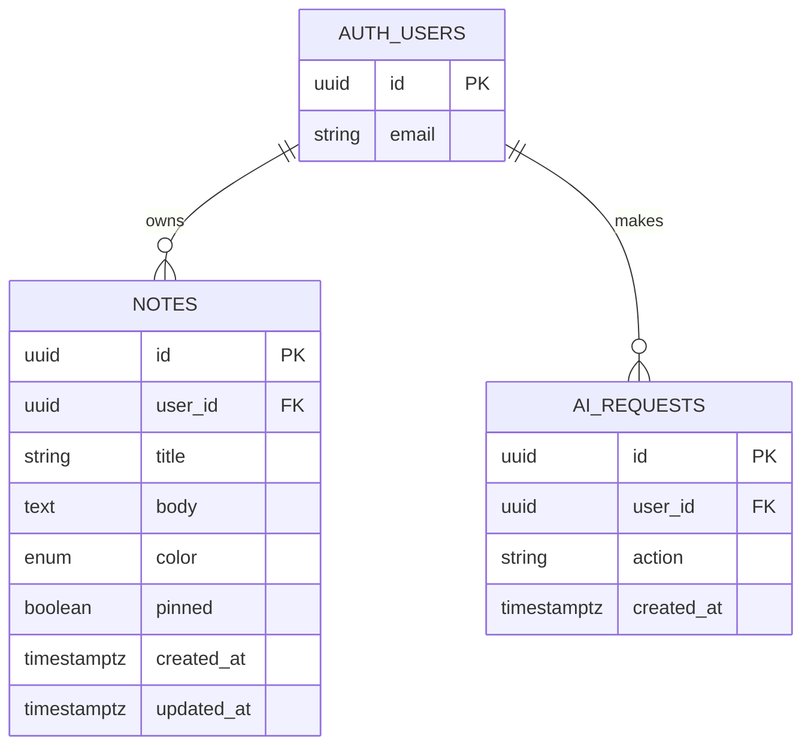

# Lumenote — Project Plan

> **Status:** Week 3 AI integration in progress — see commit history and [DIAGRAMS.md](./DIAGRAMS.md).
>
> **Assignment:** Week 3 AI API & Mini-Project Gate (builds on Week 2 foundation)

A personal notes app where authenticated users capture, organize, and manage private study notes and ideas.

**Name:** *Lumen* (light) + *note* — illuminating your ideas.

---

## 1. Problem & Solution

| | |
|---|---|
| **Problem** | Students and learners need a simple, private place to jot notes without clutter or account friction. |
| **Solution** | Lumenote — lightweight notes with secure auth, full CRUD, pin, and color labels. |
| **Comparable to** | [PolyVote](https://github.com/djaramil/PolyVote) and [ShouldWeGo](https://github.com/djaramil/ShouldWeGo) — plan → diagrams → incremental commits |

---

## 2. Week 2 Foundation (complete)

- [x] User registration, login, logout (Supabase Auth)
- [x] Create, read, update, delete personal notes
- [x] Pin notes to top of list
- [x] Color labels on notes
- [x] Protected dashboard (auth required for all note actions)
- [x] CI/CD deploy workflow + Netlify live URL
- [x] Documentation: README, PLAN, BUILD_STEPS, DIAGRAMS, DATABASE

---

## 3. Week 3 Gate Scope (in progress)

Following the [ShouldWeGo](https://github.com/djaramil/ShouldWeGo) pattern: **plan and diagram first**, then backend, then AI features, then submission docs.

| # | Deliverable | Status |
|---|-------------|--------|
| W1 | Two meaningful AI features on user data | In progress |
| W2 | Supabase Edge Function (server-side OpenAI key) | In progress |
| W3 | AI error handling, loading states, rate limits | In progress |
| W4 | API / endpoint documentation + test cases | In progress |
| W5 | Cost analysis document | In progress |
| W6 | Updated diagrams (flows, sequences, ERD) | In progress |
| W7 | README with live URL + demo video link | Pending |
| W8 | Clean incremental commit history on `main` | In progress |

### AI features (Week 3)

| Feature | Type | Value |
|---------|------|-------|
| **Summarize notes** | AI #1 | Turns saved notes into overview, key points, and follow-up actions |
| **Suggest study notes** | AI #2 | Generates personalized next-note ideas from existing content |

Both features read **only the authenticated user's notes** (via RLS) — not a generic chatbot wrapper.

### Planned commit order

1. `docs:` Week 3 planning and AI architecture diagrams
2. `feat:` add `ai_requests` schema for rate limiting
3. `feat:` add `ai-notes` Supabase Edge Function
4. `feat:` add AI assistant panel on dashboard
5. `docs:` add API tests and cost analysis
6. `docs:` complete Week 3 README for gate submission

---

## 4. Out of Scope (backlog)

Track in [ISSUES.md](./ISSUES.md) — do **not** build until MVP is done:

- Search / filter
- Tags or folders
- Markdown preview
- Google OAuth
- Real-time sync
- Export (PDF / Markdown)

---

## 5. Tech Stack

| Layer | Choice | Status |
|-------|--------|--------|
| Frontend | React 18 + Vite | ✅ |
| Routing | React Router v6 | ✅ |
| Styling | Custom CSS (see DESIGN.md) | ✅ |
| Backend / DB / Auth | Supabase (PostgreSQL + RLS) | ✅ |
| AI | OpenAI via Supabase Edge Function | Week 3 |
| Hosting | Netlify (manual CLI) + GitHub Actions | ✅ |
| Node | 18+ (20 in CI) | Required |

---

## 6. Data Model

### `notes` fields

| Field | Type | Constraints | Notes |
|-------|------|-------------|-------|
| `id` | UUID | PK | Auto-generated |
| `user_id` | UUID | FK → auth.users | CASCADE delete |
| `title` | text | 1–120 chars | Required |
| `body` | text | ≤ 10,000 chars | Optional |
| `color` | text | hex `#RRGGBB` | User-chosen via swatches or color picker |
| `pinned` | boolean | default false | Sort pinned first |
| `created_at` | timestamptz | auto | |
| `updated_at` | timestamptz | auto | |

Full schema docs: [docs/DATABASE.md](./docs/DATABASE.md)

---

## 7. Auth & Permissions

| Action | Auth? | Enforcement |
|--------|-------|-------------|
| Landing page | No | Public route |
| Register / login | No | Public routes |
| Dashboard | Yes | ProtectedRoute + RLS |
| Create / edit / delete note | Yes | Auth + RLS |
| Read notes | Yes | RLS `auth.uid() = user_id` |

---

## 8. Screens

| Screen | Route | Purpose |
|--------|-------|---------|
| Landing | `/` | Hero, features, CTA |
| Login | `/login` | Email + password |
| Register | `/register` | Sign up + confirm password |
| Dashboard | `/dashboard` | Note form + grid (protected) |

Wireframes and visual specs: **[DESIGN.md](./DESIGN.md)**

Interactive preview: **[mockup.html](./mockup.html)** — open in browser, edit CSS/HTML to iterate.

---

## 9. Build Phases (high level)

| Phase | Focus | Doc |
|-------|-------|-----|
| **A. Plan & design** | Scope, mockups, design tokens | PLAN.md, DESIGN.md, mockup.html |
| **B. Scaffold** | Vite + React + routing | BUILD_STEPS Step 0 |
| **C. Backend** | Supabase schema + RLS | BUILD_STEPS Steps 1–2 |
| **D. Auth** | Register / login / protect routes | BUILD_STEPS Step 4 |
| **E. CRUD** | Notes data layer + dashboard UI | BUILD_STEPS Steps 3, 5–6 |
| **F. Polish & deploy** | Errors, responsive, CI/CD | BUILD_STEPS Steps 7–8 |
| **G. Docs & submit** | README, demo video, issues closed | BUILD_STEPS Step 9 |
| **H. Week 3 AI** | Edge Function, AI UI, rate limits, gate docs | PLAN commit order above |

Detailed steps: [BUILD_STEPS.md](./BUILD_STEPS.md)

---

## 10. Design Decisions (locked v0.2)

| # | Question | Decision |
|---|----------|----------|
| D1 | Dashboard layout | ✅ **Form on top + card grid below** |
| D2 | Note card density | ✅ **Card grid** (`auto-fill`, min 260px) |
| D3 | Note colors | ✅ **Custom hex** + preset swatches |
| D4 | Accent color | ✅ **Teal** `#2dd4bf` |
| D5 | Pin UX | ✅ **Pin button on card** |
| D6 | Empty dashboard | ✅ **Illustration + CTA copy** |
| D7 | Auth confirm email | ✅ **Disabled for dev** |

> Logged in [DESIGN_LOG.md](./DESIGN_LOG.md) v0.2. Visual reference: [mockup.html](./mockup.html).

---

## 11. Success Criteria (Week 3 Gate)

- [ ] GitHub Classroom repo with meaningful incremental commits
- [ ] Two AI features functional and add real value
- [ ] Supabase CRUD + auth still working end-to-end
- [ ] AI error handling, loading states, rate limit messages
- [ ] API documentation and test cases ([docs/API_TESTS.md](./docs/API_TESTS.md))
- [ ] Cost analysis ([docs/COST_ANALYSIS.md](./docs/COST_ANALYSIS.md))
- [ ] Diagrams updated for AI flows ([DIAGRAMS.md](./DIAGRAMS.md))
- [ ] README with name, Z-number, FAU email, live URL, demo video
- [ ] Demo video (3–5 min): auth → CRUD → both AI features

---

## 12. Related Documents

| Document | Purpose |
|----------|---------|
| [DESIGN.md](./DESIGN.md) | Visual design system, wireframes, screen specs |
| [DESIGN_LOG.md](./DESIGN_LOG.md) | Changelog of design iterations |
| [mockup.html](./mockup.html) | Interactive static mockup (edit + refresh) |
| [BUILD_STEPS.md](./BUILD_STEPS.md) | Incremental build order (start after design sign-off) |
| [DIAGRAMS.md](./DIAGRAMS.md) | Architecture & flow diagrams |
| [docs/DATABASE.md](./docs/DATABASE.md) | Schema & RLS details |
| [ISSUES.md](./ISSUES.md) | GitHub issues for project board |

---

## 13. Next Step

1. Land Week 3 commits in order (see §3 planned commit order).
2. Deploy `ai-notes` Edge Function + set `OPENAI_API_KEY` in Supabase secrets.
3. Redeploy Netlify, record 3–5 min demo video, update README placeholders.
