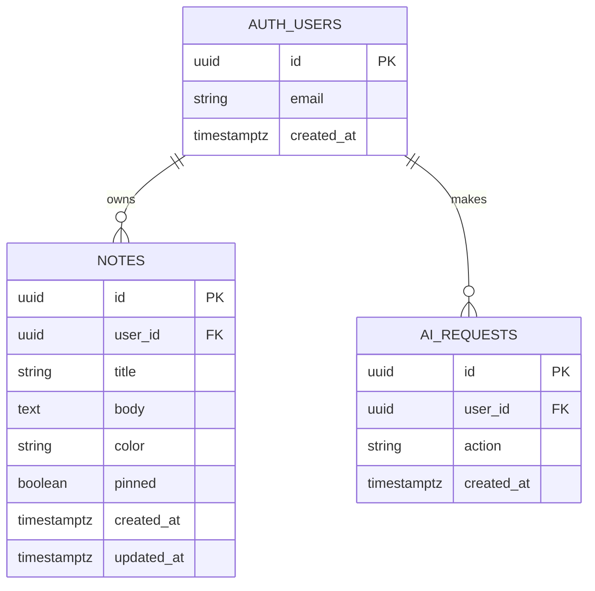

# Lumenote — Database Design

Detailed schema documentation for the Week 2 assignment.

See also: [DIAGRAMS.md](../DIAGRAMS.md) for Mermaid ERD and flow diagrams.

---

## Data Store Choice: Supabase (PostgreSQL)

| Factor | Decision |
|--------|----------|
| **Provider** | [Supabase](https://supabase.com/) — Backend-as-a-Service |
| **Database** | PostgreSQL (managed) |
| **Auth** | Supabase Auth (email/password) |
| **Why Supabase** | Free tier, built-in auth, Row Level Security, SQL schema, REST API via PostgREST, no custom server required |

**Alternatives considered:**
- **Firebase** — NoSQL; less natural for relational user→notes model
- **Back4App/Parse** — Used in PolyVote class example; Supabase chosen for PostgreSQL + RLS clarity
- **Custom backend** — More setup than required for Week 2

---

## Entity-Relationship Diagram



---

## Tables

### `auth.users` (managed by Supabase)

Created and secured by Supabase Auth. Application code interacts via the Auth API only.

| Column | Type | Notes |
|--------|------|-------|
| `id` | UUID | Primary key; referenced by `notes.user_id` |
| `email` | text | Unique login identifier |
| `encrypted_password` | text | Hashed by Supabase; never exposed |

### `notes`

| Column | Type | Constraints | Description |
|--------|------|-------------|-------------|
| `id` | UUID | PK, `gen_random_uuid()` | Unique note identifier |
| `user_id` | UUID | NOT NULL, FK → `auth.users(id)` ON DELETE CASCADE | Owner |
| `title` | TEXT | NOT NULL, 1–120 chars (trimmed) | Note heading |
| `body` | TEXT | DEFAULT `''`, max 10,000 chars | Note content |
| `color` | TEXT | DEFAULT `'#2dd4bf'`, hex check `#RRGGBB` | User-chosen color (swatch or custom picker) |
| `pinned` | BOOLEAN | DEFAULT `false` | Pin to top of list |
| `created_at` | TIMESTAMPTZ | DEFAULT `now()` | Creation time |
| `updated_at` | TIMESTAMPTZ | DEFAULT `now()`, auto-updated | Last edit time |

**Color format:** 6-digit hex (e.g. `#2dd4bf`, `#3b82f6`). Preset swatches in UI map to hex values.

**Indexes:**
- `notes_user_id_idx` on `user_id`
- `notes_pinned_updated_idx` on `(user_id, pinned DESC, updated_at DESC)`

### `ai_requests`

Tracks authenticated AI calls for rate limiting. It does not store note content or AI responses.

| Column | Type | Constraints | Description |
|--------|------|-------------|-------------|
| `id` | UUID | PK, `gen_random_uuid()` | Unique AI request identifier |
| `user_id` | UUID | NOT NULL, FK → `auth.users(id)` ON DELETE CASCADE | Owner |
| `action` | TEXT | `summarize` or `suggest` | AI feature requested |
| `created_at` | TIMESTAMPTZ | DEFAULT `now()` | Request timestamp |

**Indexes:**
- `ai_requests_user_created_idx` on `(user_id, created_at DESC)`

---

## Row Level Security (RLS)

RLS is **enabled** on `notes` and `ai_requests`. All policies require `auth.uid() = user_id`:

| Operation | Policy name | Rule |
|-----------|-------------|------|
| SELECT | Users can view own notes | `auth.uid() = user_id` |
| INSERT | Users can insert own notes | `WITH CHECK (auth.uid() = user_id)` |
| UPDATE | Users can update own notes | `USING` + `WITH CHECK` |
| DELETE | Users can delete own notes | `auth.uid() = user_id` |
| SELECT | Users can view own AI request log | `auth.uid() = user_id` |
| INSERT | Users can insert own AI request log | `WITH CHECK (auth.uid() = user_id)` |

Unauthenticated requests receive zero rows and cannot insert.

---

## Triggers

`notes_updated_at` — Before UPDATE, sets `updated_at = now()`.

---

## Validation (Defense in Depth)

| Layer | What is validated |
|-------|-------------------|
| **PostgreSQL CHECK** | Title length, body length, color hex format |
| **Client (`validation.js`)** | Same rules before API call |
| **RLS** | User can only mutate own rows |

---

## Design Decisions

1. **Single `notes` table** — Keeps the core note model focused on CRUD + auth; tags/folders deferred.
2. **Cascade delete** — Deleting a user removes their notes automatically.
3. **RLS over app-only checks** — Security enforced in the database, not only in React.
4. **Custom hex colors** — Users pick any color; stored as `#RRGGBB`, rendered on card border.
5. **Pin + color** — Lightweight organization without a separate categories table.
6. **Separate AI log** — `ai_requests` supports rate limiting without storing generated content.

---

## Setup

1. Create a Supabase project at [supabase.com/dashboard](https://supabase.com/dashboard).
2. Open **SQL Editor** → paste and run [`supabase/schema.sql`](../supabase/schema.sql).
3. (Dev) **Authentication → Providers → Email** → disable **Confirm email** (not required for dev).
4. Copy **Project URL** and **anon public key** into `.env`.

---

## Sample Queries (Supabase SQL Editor)

```sql
-- Count notes per user (admin/debug only)
SELECT user_id, count(*) FROM notes GROUP BY user_id;

-- List pinned notes for a user
SELECT title, pinned, updated_at FROM notes
WHERE user_id = 'YOUR-USER-UUID' AND pinned = true
ORDER BY updated_at DESC;
```
